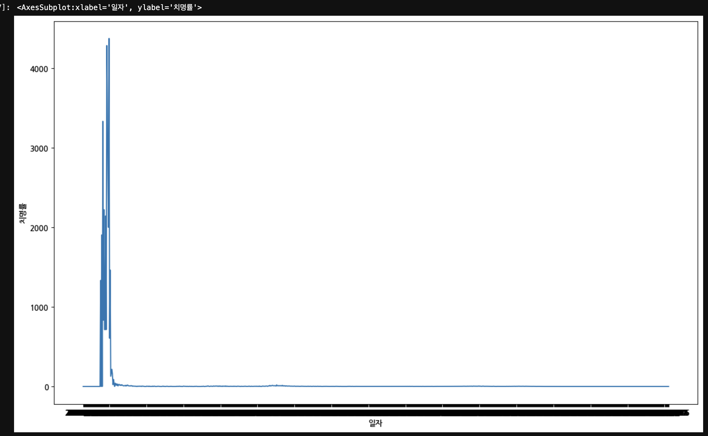
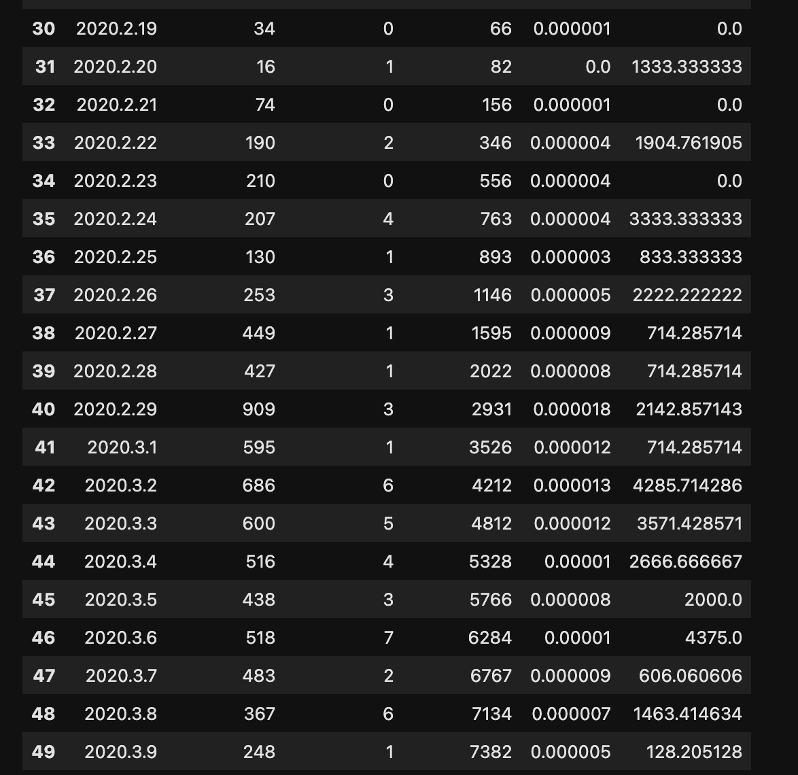
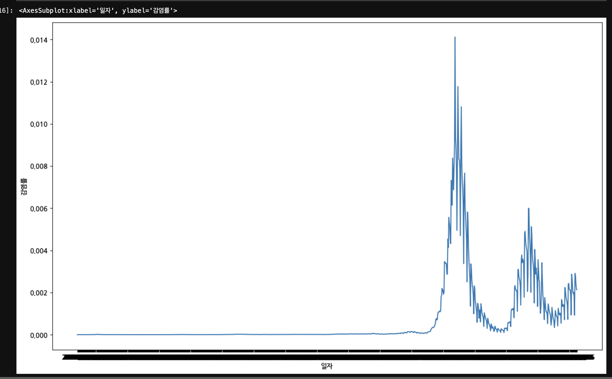

## 2022.12.04 (일) 

작성자 : 김광영

cf) 일자는 너무 빼곡해서 날짜끼리 겹쳐서 안 보입니다. 1044row가 있어서 연도, 월로 묶으려다가 일단 방향성을 보려고 그려봤습니다. 

1. 표의 마지막 줄이 치명률인데, 심각한 outlier들이 발견됨. (이미지 참고)
</img>
</img>
2. 감염률은 특정 군을 형성한 것으로 추정 가능
 여기서 문제는 그냥 눈으로만 봐도 생각한 결론(바이러스의 변이가 나타날수록, 감염률 증가) 과는 거리가 멀어 보임.
</img>
